# ZKanopy

[](LICENSE)
[](docs/devpost.md)
[](#deployed-on-base-sepolia)
[](circuits/)
[](contracts/)
[](frontend/)
[](oracle/)

**Prove your farm is deforestation-free — without revealing where it is.**

**Background.** The EU Deforestation Regulation (EUDR, Regulation (EU) 2023/1115) bans cattle, cocoa, coffee, oil
palm, rubber, soya and wood products from the EU market unless they are *deforestation-free*: grown on land that has
not been deforested after **31 December 2020**. To prove it, every operator must file a Due Diligence Statement that
includes the **geolocation of every plot** the commodity came from, and a satellite check against that cut-off. The
rules apply from 30 December 2026 for large and medium companies and from 30 June 2027 for micro and small ones
(Regulation (EU) 2025/2650). For the millions of smallholders behind Indonesian coffee and palm oil or West African
cocoa, this means handing the exact coordinates of their land to everyone up the chain — or losing the EU market.

A smallholder farmer proves cryptographically that their plot has **not been deforested after 31 December 2020** (the
EUDR cut-off) **without disclosing its coordinates**. The proof is verified on-chain, recorded as an attestation with a
nullifier (no double-selling), and exporters compile attestations into a Due Diligence Statement (DDS).

Built solo for the **IEEE ClimateChain Global Hackathon 2026 — Sustainable Supply Chains** track. Runs end-to-end on
**Base Sepolia** with real satellite data.

| | |
|---|---|
| Repository | https://github.com/MrPrinceAli/zkanopy |
| Registry contract | [`0xd5569a4557E4CaE10464Ff868f6A3594014D852f`](https://sepolia.basescan.org/address/0xd5569a4557E4CaE10464Ff868f6A3594014D852f) (Base Sepolia, chain id 84532) |
| First attestation | [`0xeb4824de…06df`](https://sepolia.basescan.org/tx/0xeb4824de2e95a8a601e667a64a431bbb769da5bf82f5287a37923cbf047706df) |
| Live demo | _deploy pending — see [Deploy the frontend](#deploy-the-frontend)_ |
| Demo script / Devpost text | [`docs/demo-script.md`](docs/demo-script.md) · [`docs/devpost.md`](docs/devpost.md) |
| Design decisions log | [`docs/decisions.md`](docs/decisions.md) · full spec in [`PRD.md`](PRD.md) |

---

## The problem

| Today | Consequence |
|---|---|
| EUDR requires geolocation of every plot and a satellite check against the 2020 cut-off; without it, cocoa, coffee, palm oil and rubber cannot enter the EU. | Smallholders risk losing market access. |
| Existing traceability platforms are centralised: farmers hand raw coordinates to the platform. | Data-sovereignty concerns — land-grabbing, competitors, misuse. |
| One plot can be "sold" to several exporters at once. | Weak integrity of Due Diligence Statements. |

## What ZKanopy does

1. **Oracle** — builds a 200 × 200 grid of ~100 m cells over a coffee landscape in the Gayo highlands (Aceh, Indonesia)
   from Hansen Global Forest Change and Sentinel-2 NDVI, labels each cell *clean* or *loss*, runs a **RandomForest QC**
   (AI #1) on the labels, and publishes the grid's Poseidon **Merkle root** to the `Registry` contract. The grid is a
   snapshot: Hansen publishes annually, so each release is republished as a new grid version and the app shows which
   version and publication date it is serving.
2. **Farmer** — taps the plot on a map; the browser resolves the cell, computes the Merkle path locally and generates a
   **Groth16 zero-knowledge proof** (~0.5 s) that the cell is clean. Coordinates never leave the device — see
   [what this does and does not hide](#privacy-and-security) for what that claim covers and what it does not.
3. **Contract** — verifies the proof, checks the root and grid parameters, binds the proof to the exporter, records a
   **nullifier** = Poseidon(row, col, season) so one cell can be attested once per season, and emits `Attested`.
4. **Exporter** — lists attestations addressed to its wallet and exports a **DDS JSON**; anyone can open
   `/verify/:id` without a wallet.
5. **Regulator** — an **IsolationForest** (AI #2) over the on-chain claim log scores exporters for suspicious claiming
   patterns. *The blockchain guarantees the AI's input; the AI watches the blockchain.*
6. **Field auditor** — on `/field`, an inspector standing on the plot enters the attestation number and the plot's
   location, and the page recomputes `Poseidon(row, col, season)` and matches it against the nullifier the contract
   stored. This closes the loop that privacy would otherwise open: the public learns nothing, while an auditor with the
   farmer's cooperation can prove the inspected plot is exactly the plot that was attested. The coordinates are used in
   the browser and never sent anywhere — only the attestation number goes to the chain, as a public read.

## Architecture


```mermaid
flowchart LR
  subgraph A["A · Geospatial oracle (Python + Node, offline)"]
    A1[GEE: Hansen GFC v1.12 + Sentinel-2 NDVI 2020/2025] --> A2[200x200 grid, clean/loss per cell]
    A2 --> A3["AI #1: RandomForest QC<br/>final = hansen AND ai"]
    A3 --> A4[Poseidon Merkle tree, depth 16]
  end
  subgraph C["C · Contracts (Base Sepolia)"]
    C1[Groth16Verifier.sol] --- C2["Registry.sol<br/>registerRoot / attest / nullifiers"]
  end
  subgraph B["B · Prover (browser)"]
    B1[Merkle path from tree.json + checkpoint.json] --> B2["snarkjs groth16.fullProve<br/>circuit DeforestationFree(16)"]
  end
  subgraph D["D · Frontend (React + wagmi)"]
    D1["/farmer"] --- D2["/exporter → DDS JSON"] --- D3["/verify/:id"] --- D4["/regulator<br/>AI #2: IsolationForest over Attested events"]
  end
  A4 -- "registerRoot(root, grid params, sha256 metadata)" --> C2
  A4 -- "tree.json (all leaves), checkpoint.json" --> B1
  B2 -- "proof + public signals" --> D1
  D1 -- "attest(proof, pubSignals, gridId, commodityHash)" --> C2
  C2 -- "Attested events, getGrid" --> D2
```

## How a proof works

The circuit [`circuits/deforestation_free.circom`](circuits/deforestation_free.circom) (circom 2.1, circomlib Poseidon,
5 050 constraints) takes the farmer's **private** inputs — fixed-point coordinates `latS = round((lat+90)·1e6)`,
`lonS = round((lon+180)·1e6)`, the cell `(row, col)` and its Merkle path — and enforces:

1. **Cell range check** — `lat0S + row·stepS ≤ latS < lat0S + (row+1)·stepS`, same for longitude, with every compared
   value proven to fit in 64 bits.
2. **Clean leaf** — `leaf = Poseidon(row, col, 1)`: the constant `1` means only *clean* cells can ever be proven.
3. **Merkle membership** — the leaf and path recompute the public `root` (Tornado/Semaphore-style checker).
4. **Nullifier** — `Poseidon(row, col, season)`: the same cell cannot be attested twice in a season, yet the cell itself
   stays hidden (Poseidon is preimage-resistant).
5. **Exporter binding** — the exporter address is a public input, so a proof stolen from the mempool is useless to
   anyone else.

Public signals, in this order and frozen: `[nullifier, root, season, exporter, lat0S, lon0S, stepS]`.
`Registry.attest` then checks, in order: root and grid parameters → `exporter == msg.sender` → Groth16 verification →
nullifier unused; reverting with `UnknownRootOrGrid`, `ExporterMismatch`, `InvalidProof` or `NullifierAlreadyUsed`.

## The two AI components

**AI #1 — label quality control** ([`oracle/03_ai_qc.py`](oracle/03_ai_qc.py)). A `RandomForestClassifier` learns the
Hansen label from `[ndvi_2020, ndvi_2025, dndvi]` on an 80/20 stratified split and scores every cell. The final label
that enters the Merkle tree is `hansen_label AND ai_label` — the AI can only *remove* clean cells, never add them.
Disagreements go to `oracle/out/review_queue.csv` for a human. Current run (40 000 cells, 6.5 % Hansen loss):
accuracy 0.87, **F1 for the loss class 0.22** — annual-median NDVI is a weak signal for partial-cell clearing, which is
exactly why it is a conservative second opinion rather than a replacement for Hansen. Full report:
[`oracle/out/ai_report.md`](oracle/out/ai_report.md).

**AI #2 — claim anomaly monitor** ([`oracle/06_claim_anomaly.py`](oracle/06_claim_anomaly.py)). Reads every
`Attested` event, builds per-exporter features (number of claims, busiest hour, share of claims within 5 minutes of
the previous one, peers active in the same season) and scores them with an `IsolationForest`. Current run: a rogue demo
wallet that fired 25 attestations in 65 s scores **1.00**; ordinary exporters score 0.00–0.10.

## Privacy and security

- **What this does and does not hide.** ZKanopy never transmits, stores or publishes a plot's coordinates — not to the
  chain, not to this platform, not to the exporter's dashboard. It does **not** remove the EUDR geolocation duty: the
  operator placing the goods on the EU market must still hold the plot's geolocation for its Due Diligence Statement.
  What changes is the blast radius. The coordinates go to that one legally bound counterparty instead of being copied
  into every platform, prospective buyer and intermediary along the way. And because the nullifier is
  `Poseidon(row, col, season)`, a field auditor standing on the plot can re-derive it and match it against the
  attestation — privacy towards the public costs nothing in accountability towards the regulator.
- **Side channels are real and worth naming.** The proof and the chain never see the plot, but the page still loads
  satellite tiles from Esri, whose `{z}/{y}/{x}` path *is* a location — at close zoom a tile request narrows the
  viewport to a few hundred metres. The region search is local (it only matches the published manifest), but the map
  background is not. So the accurate claim is not "nothing leaves": it is **the exact point never leaves**, while a
  third-party map provider can tell roughly which area is being browsed. Removing that would mean self-hosting
  imagery, which is out of scope for this MVP.
- **On-chain:** `root, nullifier, season, exporter, lat0S, lon0S, stepS`, `gridId`, `commodityHash`. **Never** the
  plot's latitude/longitude or its cell.
- The whole grid (`tree.json`, 3 MB) is downloaded to the client so Merkle-path lookups happen locally — the server never
  learns which cell was requested.
- `metadataURI` on-chain is the sha256 of [`frontend/public/data/metadata.json`](frontend/public/data/metadata.json),
  which in turn pins `sha256(tree.json)`, the datasets, the labelling rule and the AI metrics.
- Reverts are surfaced by name after a simulation, so a rejected claim costs no gas; `attest` is sent with an explicit
  gas limit because a malformed proof would otherwise burn the whole allowance in the pairing precompile.
- **Not addressed in this MVP (roadmap):** a single oracle could publish a false root (→ threshold attestors); timing
  correlation between a `tree.json` download and a transaction; GPS accuracy of the farmer's device; the Groth16 setup is
  a single-party contribution.

## Screenshots

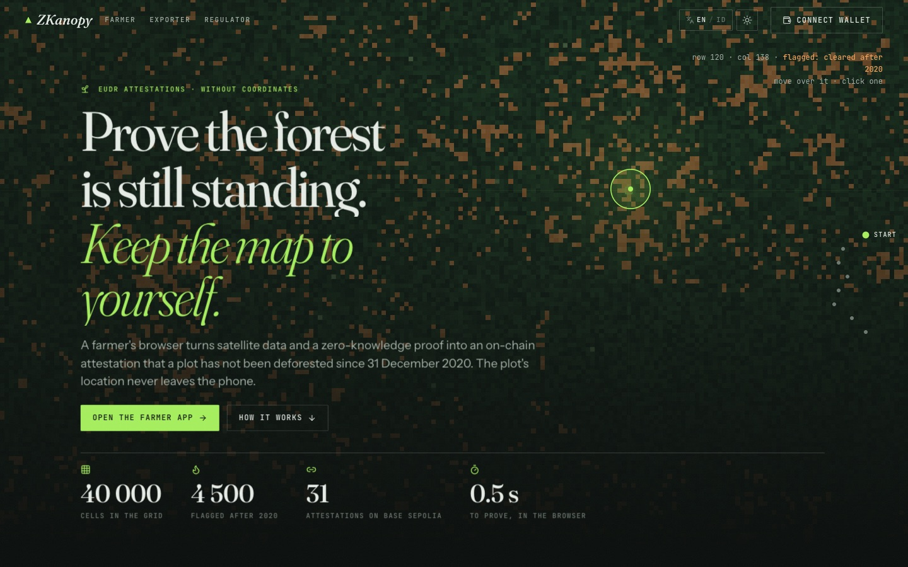

| Chapter 1 — five seasons, scrubbed by scrolling | Light theme (toggle in the header) |
|---|---|
| 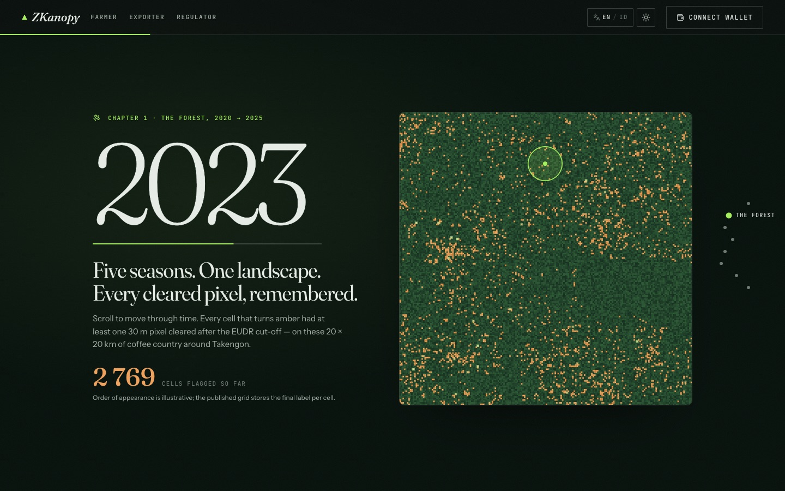 | 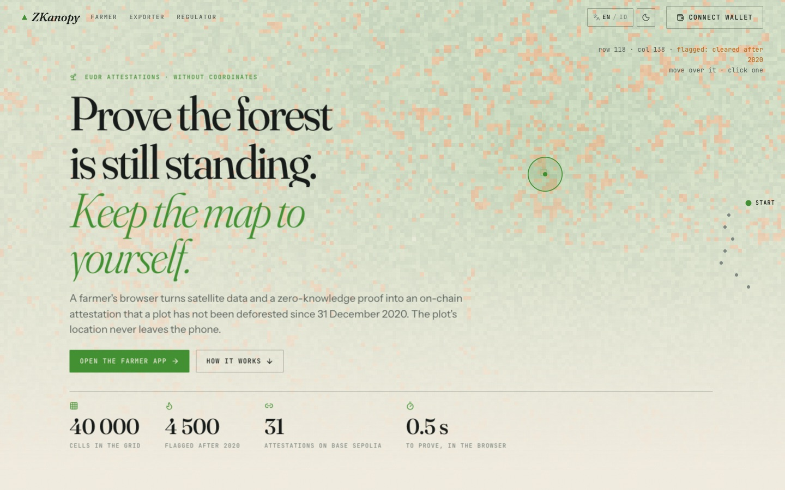 |

| Chapter 3 — the phone follows the step you are reading | Chapter 4 — what leaves the phone (flip card) |
|---|---|
| 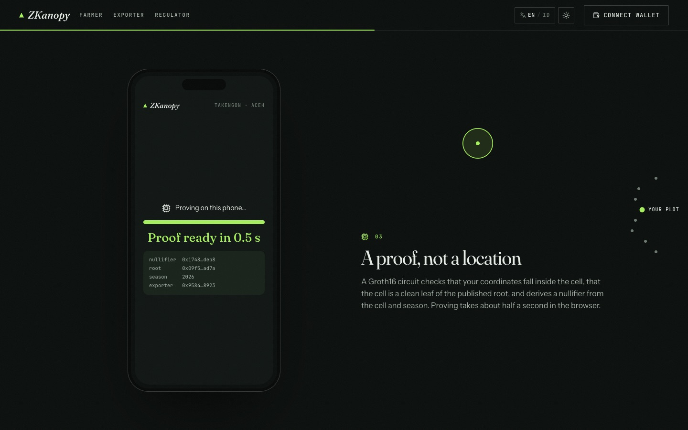 | 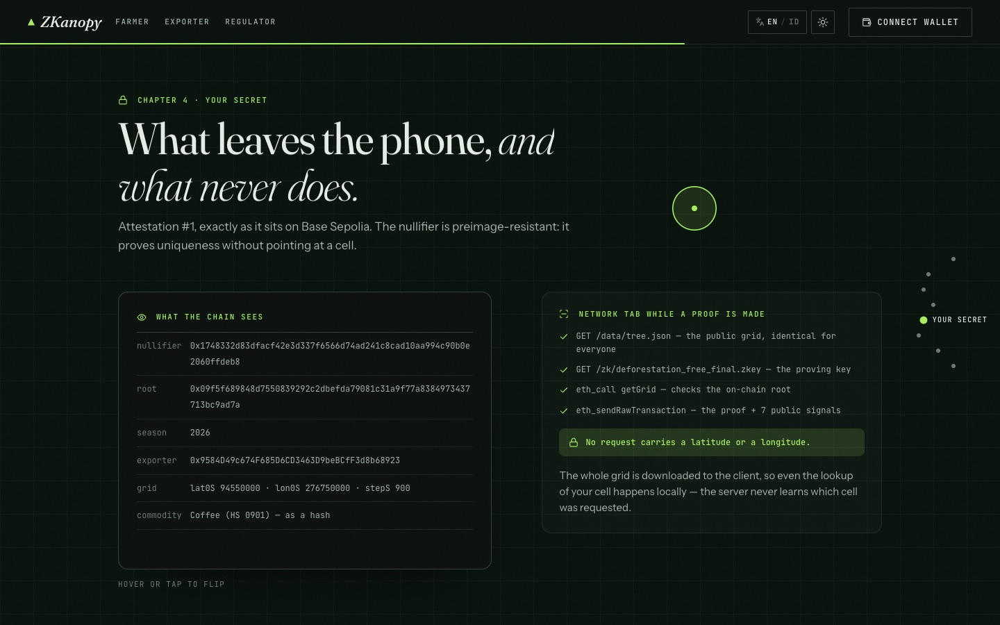 |

| Chapter 5 — the two models, a sideways strip | Chapter 7 — your turn |
|---|---|
| 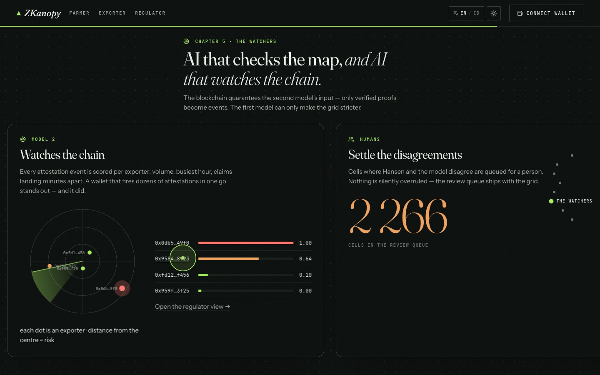 | 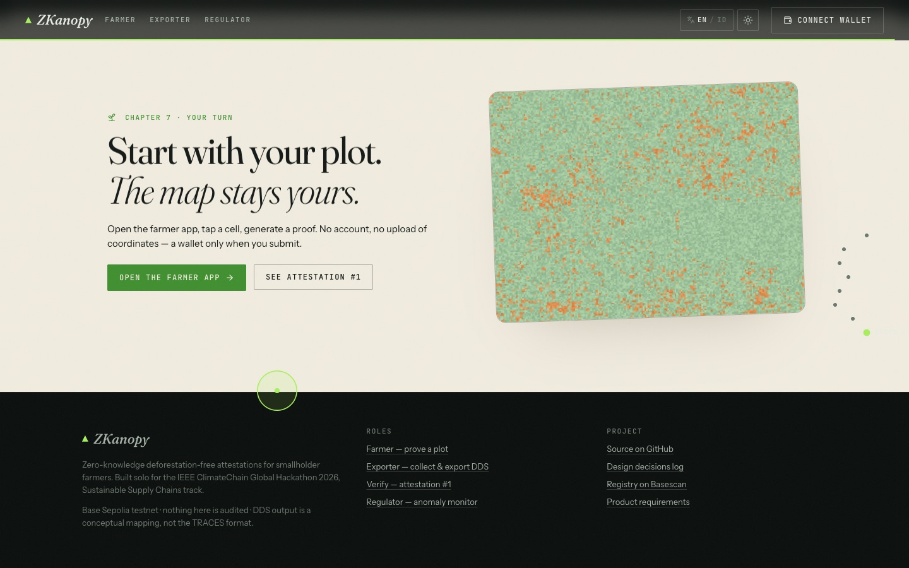 |

| Farmer: proof generated in the browser | Farmer: loss cell blocked |
|---|---|
| 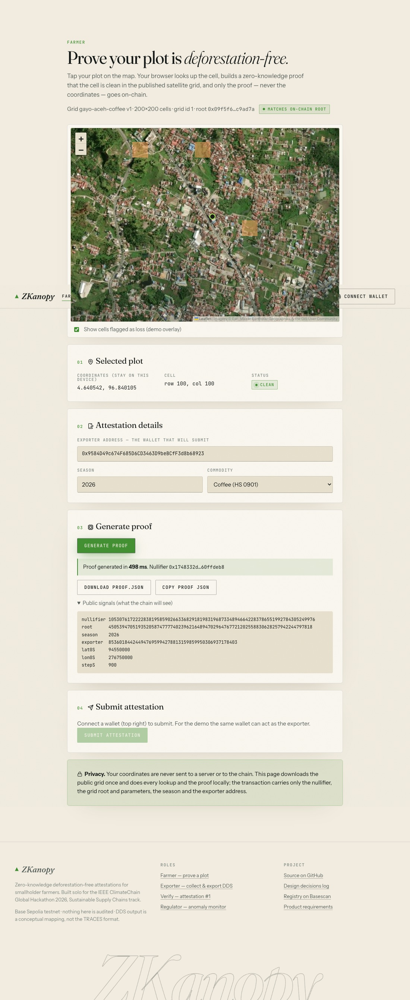 | 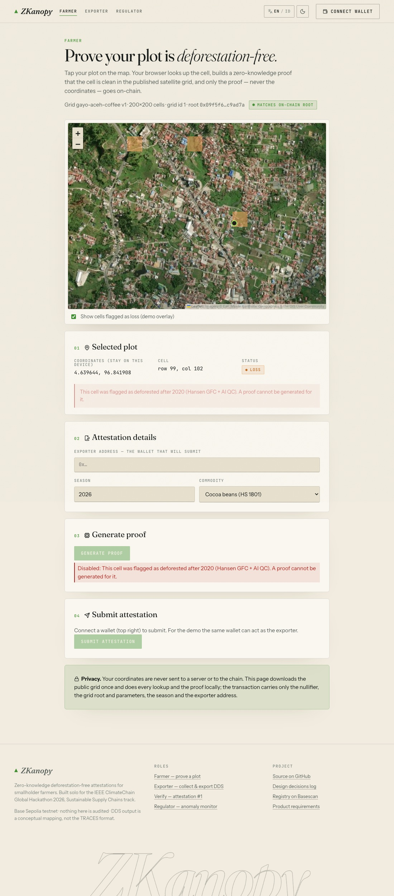 |

| Exporter: DDS export | Regulator: anomaly monitor |
|---|---|
| 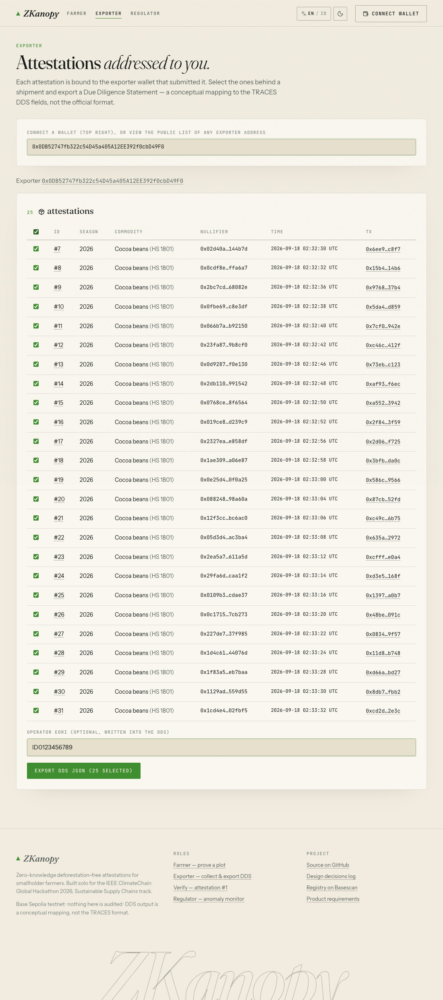 | 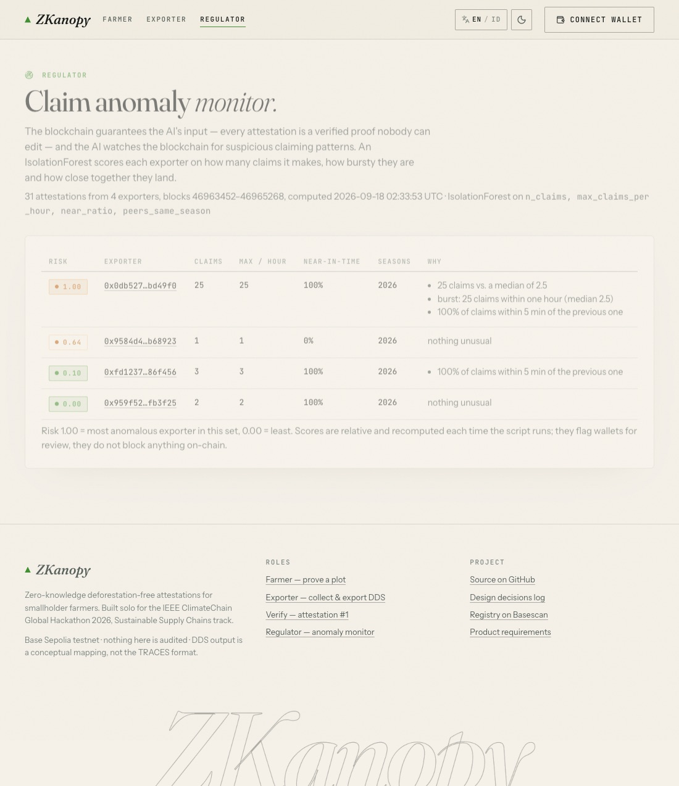 |

| Bahasa Indonesia, light theme (farmer) | Verify page — no wallet needed |
|---|---|
| 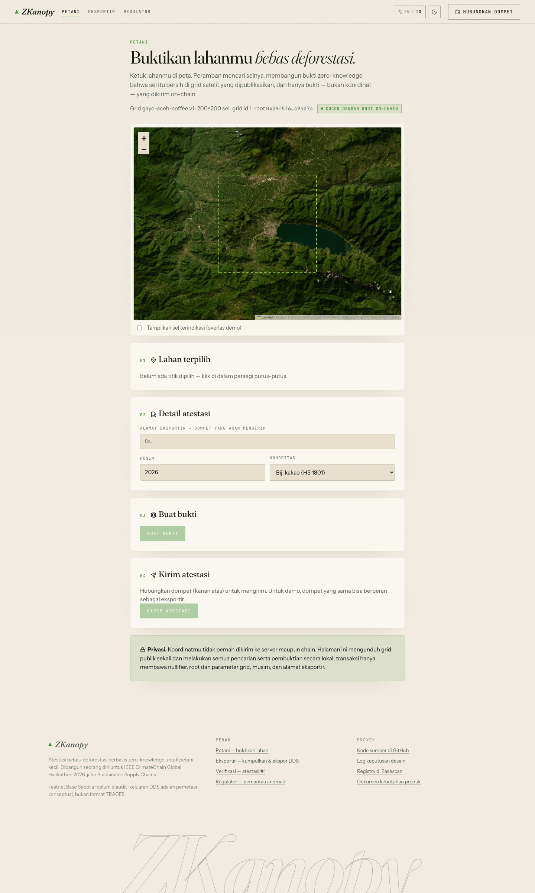 | 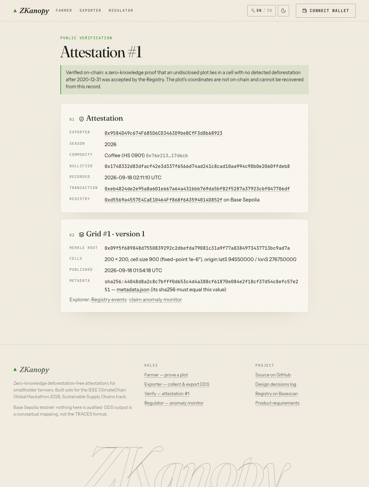 |

## Deployed on Base Sepolia

| Contract | Address | Deploy tx |
|---|---|---|
| `Groth16Verifier` | [`0x0d8958182C99a481b0F76D1C68Fdf7C23921ffBb`](https://sepolia.basescan.org/address/0x0d8958182C99a481b0F76D1C68Fdf7C23921ffBb) | [`0xf86f03a1…4373d`](https://sepolia.basescan.org/tx/0xf86f03a17a92bb5c965936bf22fc7fd03e40bb675be601f445bacaa29cd4373d) |
| `Registry` | [`0xd5569a4557E4CaE10464Ff868f6A3594014D852f`](https://sepolia.basescan.org/address/0xd5569a4557E4CaE10464Ff868f6A3594014D852f) | [`0xeabacfce…5d951`](https://sepolia.basescan.org/tx/0xeabacfcefea48b5a6ac21b5164ec3128b9355f5c80c7f742199f30b65f85d951) |

Deployed at block 46963452 (2026-09-18). Owner and oracle: `0x9584D49c674F685D6CD3463D9beBCfF3d8b68923` (project
testnet wallet). Addresses are also exported from [`frontend/src/config.ts`](frontend/src/config.ts).

Five grids are published, across five countries, three continents and three commodities. Each is an independent
Merkle root; `Registry` stores as many as are registered, and every attestation records which one it was proven
against. The app reads them from [`frontend/public/data/regions.json`](frontend/public/data/regions.json); the farmer
just drops a pin and the app finds the grid.

| `gridId` | Region | Country · crop | Hansen loss | AI QC accuracy | F1 (flagged) | Final clean / flagged |
|---|---|---|---|---|---|---|
| 1 | Gayo highlands, Aceh | Indonesia · coffee | 6.53 % | 0.8695 | 0.2162 | 35 500 / 4 500 |
| 2 | Juaboso, Western North | Ghana · cocoa | 9.29 % | 0.8303 | 0.2150 | 34 143 / 5 857 |
| 3 | Soubré, Nawa | Côte d'Ivoire · cocoa | 8.98 % | 0.8277 | 0.2344 | 34 061 / 5 939 |
| 4 | Đắk Lắk, Central Highlands | Vietnam · coffee | 5.31 % | 0.8978 | 0.2509 | 36 291 / 3 709 |
| 5 | Novo Progresso, Pará | Brazil · soy | 18.91 % | 0.8036 | **0.5685** | 29 073 / 10 927 |

All five are 200 × 200 cells of `stepS = 900` (0.0009°, ~100 m) ≈ 20 × 20 km, 40 000 leaves, depth 16, built from real
Hansen v1.12 and Sentinel-2 data. `registerRoot` transactions are in each region's
`frontend/public/data/<slug>/grid.json`.

**The Brazil row is the interesting one.** The same model, the same features, the same code — and F1 on the flagged
class jumps from ~0.22 to 0.57. That is not a better model, it is a bigger signal: on the Amazon frontier a clearing
takes a whole cell, so annual NDVI sees it, while in a smallholder mosaic one cleared 30 m pixel hides inside a
hectare of intact canopy. The model's accuracy tracks the *scale of clearing*, which is exactly what the physics
predicts. That is the case for the conservative `hansen ∧ ai` rule and the human review queue, and the reason
per-biome calibration is on the roadmap rather than claimed as solved.

## Reproduce it

### Toolchain

| Tool | Version used |
|---|---|
| Node.js / npm | 20.x / 10.x |
| circom / snarkjs | 2.1.9 (built from source) / 0.7.6 |
| Foundry (forge, cast, anvil) | 1.7.x |
| Python | 3.14 (virtualenv in `.venv`, deps in [`oracle/requirements.txt`](oracle/requirements.txt)) |
| Google Earth Engine | non-commercial account + a registered Cloud project |

```bash
git clone --recurse-submodules https://github.com/MrPrinceAli/zkanopy.git && cd zkanopy
cp .env.example .env            # PRIVATE_KEY (testnet wallet), RPC_URL, GEE_PROJECT
npm install                     # circomlib, circomlibjs, snarkjs, viem, mocha …
python3 -m venv .venv && .venv/bin/pip install -r oracle/requirements.txt
```

### 1 · Circuit

```bash
# needs circuits/pot16_final.ptau — download the Hermez pot16 or generate one:
#   snarkjs powersoftau new bn128 16 pot16_0000.ptau && snarkjs powersoftau contribute pot16_0000.ptau pot16_0001.ptau -e="random"
#   snarkjs powersoftau prepare phase2 pot16_0001.ptau circuits/pot16_final.ptau
bash circuits/build.sh          # compile → Groth16 setup → verifier + vkey → sanity proof → contract fixture
npm test                        # 22 mocha tests: witness cases, Groth16 prove/verify, Merkle builder, tree × circuit
```

> Every `build.sh` run makes a **new** zkey/verifier pair (fresh phase-2 contribution). The deployed contracts match the
> zkey shipped with the demo (`frontend/public/zk/`, synced by `frontend/scripts/sync-zk.mjs` from `circuits/build/` or
> `ZKEY_URL`). If you rebuild, redeploy the verifier and update `frontend/src/config.ts`.

### 2 · Contracts

```bash
cd contracts
forge test -vv                  # 10 tests, driven by the real proof fixture
forge script script/Deploy.s.sol --rpc-url "$RPC_URL" --private-key "$PRIVATE_KEY" --broadcast
```

### 3 · Oracle and AI

Each region is one file in [`oracle/regions/`](oracle/regions/) and every step takes `--region <slug>`, writing
under `oracle/{data,out}/<slug>/` and `frontend/public/data/<slug>/`. Adding a country means adding a YAML file and
running these six commands; nothing else changes, and an existing grid is never touched.

```bash
.venv/bin/earthengine authenticate                          # once; then GEE_PROJECT=<your project> in .env
R=juaboso-ghana                                             # or gayo-aceh, or a new regions/<slug>.yaml
.venv/bin/python oracle/01_export_gee.py   --region $R      # GeoTIFFs → oracle/data/$R/ (~2 min)
.venv/bin/python oracle/02_build_grid.py   --region $R      # per-cell frac_loss, NDVI, hansen_label
.venv/bin/python oracle/03_ai_qc.py        --region $R      # RandomForest QC → cells_final.csv, review_queue.csv, ai_report.md
node oracle/04_build_merkle.js             --region $R      # Poseidon tree → frontend/public/data/$R/{tree,checkpoint,metadata}.json
node oracle/05_publish_root.js             --region $R      # Registry.registerRoot → grid.json + refreshes data/regions.json
.venv/bin/python -m pytest                                  # 17 tests
```

No Earth Engine access? `oracle/02_build_grid.py --synthetic` builds a random grid so the rest of the pipeline runs.
Configuration (AOI, years, datasets) lives in [`oracle/config.yaml`](oracle/config.yaml).

### 4 · Frontend

```bash
cd frontend && npm install
npm run dev                     # syncs wasm + zkey into public/zk (gitignored), serves http://localhost:5173
npm test                        # 15 vitest tests (client Merkle paths vs. the published tree, DDS, log windows)
npm run build                   # tsc + vite build → dist/
```

Pages: `/` (a seven-chapter, scroll-driven landing page drawn from the real grid and live chain data), `/farmer`,
`/exporter`, `/verify/:id`, `/regulator`, `/field` — the auditor's check, see below — and `/flow`, the whole process in
six plain-language steps (a clickable
strip plus one line per step that opens for its detail). A wallet on Base Sepolia (MetaMask or any injected wallet) is
needed only to submit attestations.

- **Landing chapters** — a hero canvas that renders the 40 000 published cells as pixels (ambient twinkle, satellite
  sweep, pointer readout of the real row/col/label, click pulses); *The forest, 2020 → 2025*: a pinned timeline you
  scrub by scrolling, cleared cells turning amber season by season; *The problem*: a paper interlude; *How it works*: a
  phone mock-up in a sticky, tilting frame whose screen follows the step you are reading; *Your secret*: a flip card of
  attestation #1 as the chain sees it vs. the network tab while a proof is made; *The two models*: a sideways strip
  with the RandomForest radar and the IsolationForest ranking; *Your turn*: the live attestation feed and the CTA.
  Chapter dots on the right jump between them (GSAP ScrollTrigger; single column on phones).
- **Dark / light theme** — toggle in the header (circular reveal via the View Transitions API); defaults to the system
  setting, remembered in `localStorage`, applied before first paint by an inline script in `index.html`.
- **English / Bahasa Indonesia** — `EN / ID` toggle in the header; defaults to the browser language. Dictionaries live in
  `src/i18n/{en,id}.ts` (typed, every key must exist in both). Commodity names are translated for display only — the
  on-chain `commodityHash` always uses the English `"<HS>:<description>"` string.
- **Look and motion** — a "forest night" editorial theme (Fraunces / Instrument Sans / JetBrains Mono via Google Fonts)
  with lucide icons throughout, word-mask headlines, magnetic buttons, 3D-tilting visuals, a custom cursor (landing
  only), a data marquee, pointer-following panel glows and page transitions. Everything respects
  `prefers-reduced-motion`. The farmer map sits on Esri World Imagery tiles.
- **Chain reads** — `eth_getLogs` is used only for transaction links, always in ≤ 9 000-block windows estimated from the
  attestation timestamps (the public RPC caps a range at 10 000 blocks); everything else comes from contract reads.

### 5 · Demo data and the anomaly monitor

```bash
node scripts/attest.mjs --row 100 --col 101 --commodity coffee   # prove + submit one cell from the .env wallet
node scripts/seed-demo.mjs                                        # 2 ordinary exporters + 1 rogue wallet (keys in .env)
.venv/bin/python oracle/06_claim_anomaly.py                       # Attested events → risk.json for /regulator
```

### Deploy the frontend

The proving key must not be committed, so either deploy from a machine that has it:

```bash
cd frontend && npx vercel deploy --prod        # .vercelignore lets public/zk/ upload
```

or use Vercel's git integration and set `ZKEY_URL` / `WASM_URL` (a hosted copy of the artefacts) as build environment
variables — `scripts/sync-zk.mjs` downloads them during `prebuild`. Optionally set `VITE_RPC_URL`.

## Repository layout

```
circuits/     deforestation_free.circom, build.sh, test/ (mocha), build/ (wasm + vkey committed, zkey ignored)
contracts/    Foundry: src/Registry.sol, src/Groth16Verifier.sol (generated), test/, script/Deploy.s.sol, broadcast/
oracle/       config.yaml, 01–06 pipeline scripts, tests/ (pytest + mocha), out/ai_report.md
packages/     merkle/ — Poseidon Merkle helpers shared by circuit tests and the oracle
frontend/     Vite + React app: src/pages/{Farmer,Exporter,Verify,Regulator}.tsx, src/lib/{merkle,prover,contract,dds,…}.ts,
              public/data/{tree,checkpoint,metadata,grid,risk}.json, public/zk/ (synced)
scripts/      attest.mjs (CLI twin of /farmer), seed-demo.mjs
docs/         architecture.{svg,png}, demo-script.md, devpost.md, decisions.md, screenshots/
```

## Compared with a centralised traceability platform

| | Centralised platform | ZKanopy |
|---|---|---|
| Where the plot coordinates live | On the platform's servers, shared with the operator | On the farmer's device only |
| What the exporter / regulator sees | Coordinates + a platform-issued status | A verifiable on-chain attestation: proof accepted, root, season, nullifier |
| Satellite check | Done by the platform, trust its result | Done against a published grid whose root and data hashes are on-chain; anyone can recompute |
| Double-selling of a plot | Detectable only inside one platform | Nullifier per (cell, season) enforced by the contract across all exporters |
| Auditability | Platform logs | Public event log; `/verify/:id` needs no account |
| Lock-in | Farmer data is the platform's asset | Open contracts and formats; the farmer keeps the data |
| Trade-off | Simple, mature, no cryptography | One oracle publishes the grid (threshold attestors on the roadmap); proofs need a modern browser |

## Known limitations

Stated plainly, because a reviewer will find them anyway.

| # | Limitation | What it means in practice |
|---|---|---|
| 1 | **No proof of land ownership.** The circuit proves a *cell* is clean; nothing binds the claimant to that cell. | Anyone can attest a cell they do not farm. Worse, because a cell can be attested only once per season, a bad actor could pre-claim clean cells and lock the real farmer out until the next season. A cooperative co-signature is the intended fix (roadmap). |
| 2 | **Satellite "loss" is not EUDR "deforestation".** Hansen reports that tree cover disappeared, not what the land became. | Logging followed by regrowth, fire and storm damage all register as loss, while EUDR only prohibits conversion of forest to agricultural use. ZKanopy is therefore a *screening* layer: it narrows what a human has to look at, it does not issue a verdict. |
| 3 | **One plot = one ~100 m cell.** | Fits a smallholder plot; a larger or irregularly shaped holding is not represented. Polygons with the 128 m buffer are roadmap. |
| 4 | **Five published regions** (Indonesia, Ghana, Côte d'Ivoire, Vietnam, Brazil). | Adding one is a YAML file plus one transaction, but a farmer outside the published areas still cannot use the app; the map shows the outlines so that is visible rather than surprising. Coverage is a data-pipeline cost, not an architectural limit — and labels have to be checked per landscape before a region is worth publishing. |
| 10 | **The grid has no crop layer.** It measures tree-cover loss and greenness, nothing else. | `commodity` is a label in the region's config, not something detected from imagery. A "clean" cell may be water, a road or a village rather than a farm. Combined with row 1, that means someone could attest a cell that is a lake. Filtering by a land-cover product is roadmap. |
| 11 | **Map imagery is third-party.** Tile requests reveal roughly which area is being browsed. | See *Privacy and security*. The exact plot is still never disclosed, and the search box does not call out at all. |
| 5 | **The map is only as fresh as its source.** Hansen publishes annually, and v1.12 tops out at `lossyear` 24. | The effective detection window is 2021–2024; clearing from the last few months is not visible yet. Each release means republishing the root as a new grid version. |
| 6 | **A single oracle publishes the root.** | One wallet could publish a false grid. Threshold attestors are roadmap. |
| 7 | **The trusted setup has one contributor.** | Acceptable for a hackathon MVP, not for production. A multi-party ceremony must replace it. |
| 8 | **The DDS export is a conceptual mapping**, not the official TRACES format, and nothing is filed with any EU system. | The exporter still files the real statement through the official channel. |
| 9 | **Testnet only, not audited, contracts not source-verified on Basescan.** | Nothing here should be used for a real shipment. |

## Roadmap

- Polygon plots with the EUDR 128 m buffer (multi-cell proofs) instead of one point = one cell.
- Threshold / multi-attestor oracle for grid roots; multi-party trusted setup for the circuit.
- Grid versioning with a public `metadataURI` URL and an update cadence (Hansen 2025 release).
- Real TRACES API integration for DDS filing; proof of land legality.
- Batched attestations, mobile-first wallet flow, code-split proving assets.
- Mainnet deployment after an audit; gas optimisation.

## Data sources and acknowledgements

- Hansen, M.C. et al. *Global Forest Change* v1.12 (2000–2024), via Google Earth Engine (`UMD/hansen/global_forest_change_2024_v1_12`).
- Copernicus Sentinel-2 Surface Reflectance (Harmonized), via Google Earth Engine.
- circom / circomlib / snarkjs (iden3), Foundry, viem/wagmi, Leaflet with Esri World Imagery tiles (© Esri, Maxar,
  Earthstar Geographics & the GIS User Community), poseidon-lite, GSAP, Fraunces / Instrument Sans / JetBrains Mono.

The DDS JSON produced here is a conceptual mapping to the EUDR Due Diligence Statement fields, not the official TRACES
format. All wallets and contracts are on a testnet; nothing here is audited.
