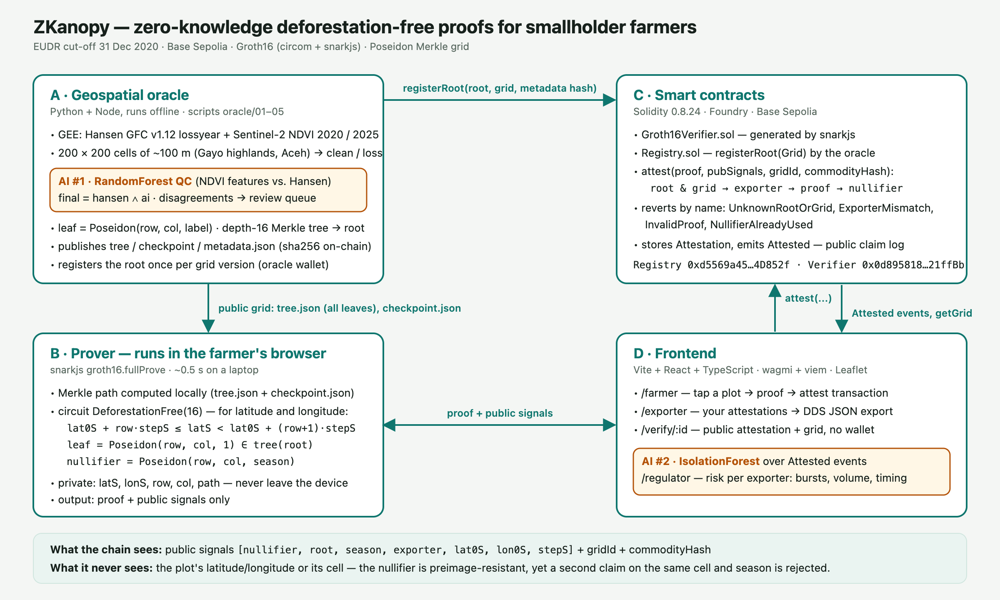
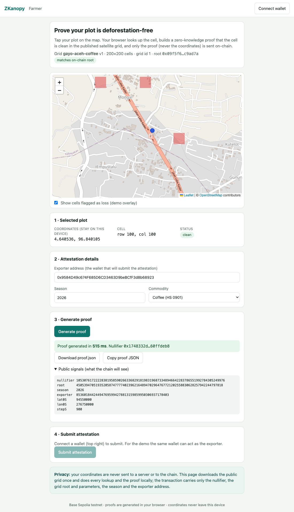
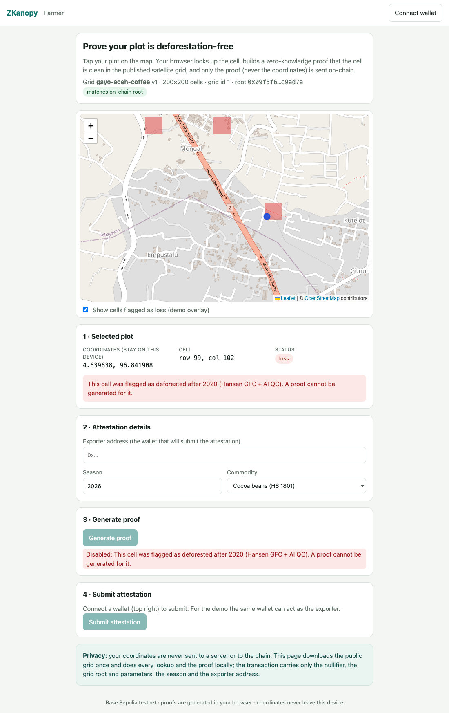
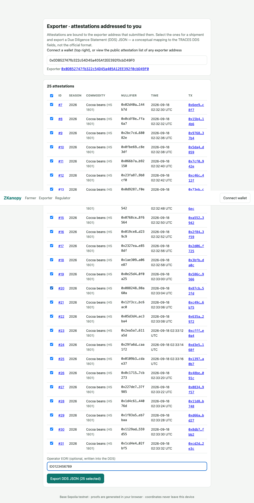
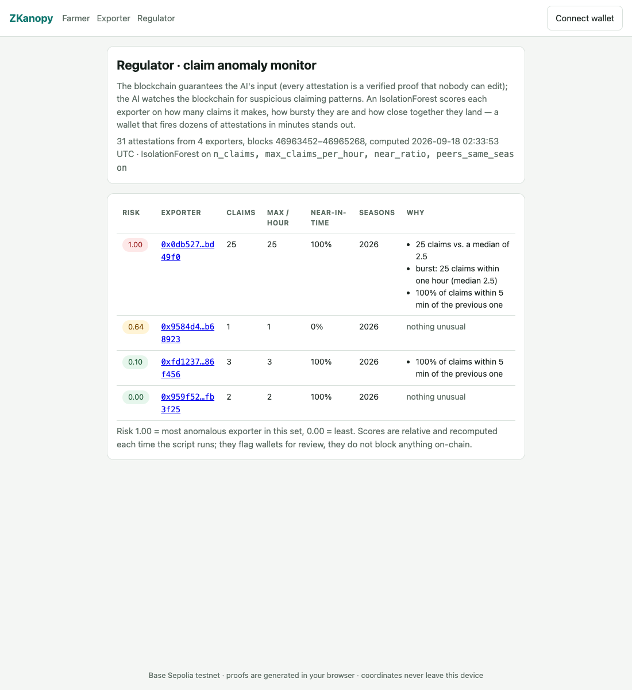

# ZKanopy

**Prove your farm is deforestation-free — without revealing where it is.**

A smallholder farmer proves cryptographically that their plot has **not been deforested after 31 December 2020** (the
EUDR cut-off) **without disclosing its coordinates**. The proof is verified on-chain, recorded as an attestation with a
nullifier (no double-selling), and exporters compile attestations into a Due Diligence Statement (DDS).

Built solo for the **IEEE ClimateChain Global Hackathon 2026 — Sustainable Supply Chains** track. Runs end-to-end on
**Base Sepolia** with real satellite data.

| | |
|---|---|
| Repository | https://github.com/MrPrinceAli/zkanopy |
| Registry contract | [`0xd5569a4557E4CaE10464Ff868f6A3594014D852f`](https://sepolia.basescan.org/address/0xd5569a4557E4CaE10464Ff868f6A3594014D852f) (Base Sepolia, chain id 84532) |
| First attestation | [`0xeb4824de…06df`](https://sepolia.basescan.org/tx/0xeb4824de2e95a8a601e667a64a431bbb769da5bf82f5287a37923cbf047706df) |
| Live demo | _deploy pending — see [Deploy the frontend](#deploy-the-frontend)_ |
| Demo script / Devpost text | [`docs/demo-script.md`](docs/demo-script.md) · [`docs/devpost.md`](docs/devpost.md) |
| Design decisions log | [`docs/decisions.md`](docs/decisions.md) · full spec in [`PRD.md`](PRD.md) |

---

## The problem

| Today | Consequence |
|---|---|
| EUDR requires geolocation of every plot and a satellite check against the 2020 cut-off; without it, cocoa, coffee, palm oil and rubber cannot enter the EU. | Smallholders risk losing market access. |
| Existing traceability platforms are centralised: farmers hand raw coordinates to the platform. | Data-sovereignty concerns — land-grabbing, competitors, misuse. |
| One plot can be "sold" to several exporters at once. | Weak integrity of Due Diligence Statements. |

## What ZKanopy does

1. **Oracle** — builds a 200 × 200 grid of ~100 m cells over a coffee landscape in the Gayo highlands (Aceh, Indonesia)
   from Hansen Global Forest Change and Sentinel-2 NDVI, labels each cell *clean* or *loss*, runs a **RandomForest QC**
   (AI #1) on the labels, and publishes the grid's Poseidon **Merkle root** to the `Registry` contract.
2. **Farmer** — taps the plot on a map; the browser resolves the cell, computes the Merkle path locally and generates a
   **Groth16 zero-knowledge proof** (~0.5 s) that the cell is clean. Coordinates never leave the device.
3. **Contract** — verifies the proof, checks the root and grid parameters, binds the proof to the exporter, records a
   **nullifier** = Poseidon(row, col, season) so one cell can be attested once per season, and emits `Attested`.
4. **Exporter** — lists attestations addressed to its wallet and exports a **DDS JSON**; anyone can open
   `/verify/:id` without a wallet.
5. **Regulator** — an **IsolationForest** (AI #2) over the on-chain claim log scores exporters for suspicious claiming
   patterns. *The blockchain guarantees the AI's input; the AI watches the blockchain.*

## Architecture

```mermaid
flowchart LR
  subgraph A["A · Geospatial oracle (Python + Node, offline)"]
    A1[GEE: Hansen GFC v1.12 + Sentinel-2 NDVI 2020/2025] --> A2[200x200 grid, clean/loss per cell]
    A2 --> A3["AI #1: RandomForest QC<br/>final = hansen AND ai"]
    A3 --> A4[Poseidon Merkle tree, depth 16]
  end
  subgraph C["C · Contracts (Base Sepolia)"]
    C1[Groth16Verifier.sol] --- C2["Registry.sol<br/>registerRoot / attest / nullifiers"]
  end
  subgraph B["B · Prover (browser)"]
    B1[Merkle path from tree.json + checkpoint.json] --> B2["snarkjs groth16.fullProve<br/>circuit DeforestationFree(16)"]
  end
  subgraph D["D · Frontend (React + wagmi)"]
    D1["/farmer"] --- D2["/exporter → DDS JSON"] --- D3["/verify/:id"] --- D4["/regulator<br/>AI #2: IsolationForest over Attested events"]
  end
  A4 -- "registerRoot(root, grid params, sha256 metadata)" --> C2
  A4 -- "tree.json (all leaves), checkpoint.json" --> B1
  B2 -- "proof + public signals" --> D1
  D1 -- "attest(proof, pubSignals, gridId, commodityHash)" --> C2
  C2 -- "Attested events, getGrid" --> D2
```





## How a proof works

The circuit [`circuits/deforestation_free.circom`](circuits/deforestation_free.circom) (circom 2.1, circomlib Poseidon,
5 050 constraints) takes the farmer's **private** inputs — fixed-point coordinates `latS = round((lat+90)·1e6)`,
`lonS = round((lon+180)·1e6)`, the cell `(row, col)` and its Merkle path — and enforces:

1. **Cell range check** — `lat0S + row·stepS ≤ latS < lat0S + (row+1)·stepS`, same for longitude, with every compared
   value proven to fit in 64 bits.
2. **Clean leaf** — `leaf = Poseidon(row, col, 1)`: the constant `1` means only *clean* cells can ever be proven.
3. **Merkle membership** — the leaf and path recompute the public `root` (Tornado/Semaphore-style checker).
4. **Nullifier** — `Poseidon(row, col, season)`: the same cell cannot be attested twice in a season, yet the cell itself
   stays hidden (Poseidon is preimage-resistant).
5. **Exporter binding** — the exporter address is a public input, so a proof stolen from the mempool is useless to
   anyone else.

Public signals, in this order and frozen: `[nullifier, root, season, exporter, lat0S, lon0S, stepS]`.
`Registry.attest` then checks, in order: root and grid parameters → `exporter == msg.sender` → Groth16 verification →
nullifier unused; reverting with `UnknownRootOrGrid`, `ExporterMismatch`, `InvalidProof` or `NullifierAlreadyUsed`.

## The two AI components

**AI #1 — label quality control** ([`oracle/03_ai_qc.py`](oracle/03_ai_qc.py)). A `RandomForestClassifier` learns the
Hansen label from `[ndvi_2020, ndvi_2025, dndvi]` on an 80/20 stratified split and scores every cell. The final label
that enters the Merkle tree is `hansen_label AND ai_label` — the AI can only *remove* clean cells, never add them.
Disagreements go to `oracle/out/review_queue.csv` for a human. Current run (40 000 cells, 6.5 % Hansen loss):
accuracy 0.87, **F1 for the loss class 0.22** — annual-median NDVI is a weak signal for partial-cell clearing, which is
exactly why it is a conservative second opinion rather than a replacement for Hansen. Full report:
[`oracle/out/ai_report.md`](oracle/out/ai_report.md).

**AI #2 — claim anomaly monitor** ([`oracle/06_claim_anomaly.py`](oracle/06_claim_anomaly.py)). Reads every
`Attested` event, builds per-exporter features (number of claims, busiest hour, share of claims within 5 minutes of
the previous one, peers active in the same season) and scores them with an `IsolationForest`. Current run: a rogue demo
wallet that fired 25 attestations in 65 s scores **1.00**; ordinary exporters score 0.00–0.10.

## Privacy and security

- **On-chain:** `root, nullifier, season, exporter, lat0S, lon0S, stepS`, `gridId`, `commodityHash`. **Never** the
  plot's latitude/longitude or its cell.
- The whole grid (`tree.json`, 3 MB) is downloaded to the client so Merkle-path lookups happen locally — the server never
  learns which cell was requested.
- `metadataURI` on-chain is the sha256 of [`frontend/public/data/metadata.json`](frontend/public/data/metadata.json),
  which in turn pins `sha256(tree.json)`, the datasets, the labelling rule and the AI metrics.
- Reverts are surfaced by name after a simulation, so a rejected claim costs no gas; `attest` is sent with an explicit
  gas limit because a malformed proof would otherwise burn the whole allowance in the pairing precompile.
- **Not addressed in this MVP (roadmap):** a single oracle could publish a false root (→ threshold attestors); timing
  correlation between a `tree.json` download and a transaction; GPS accuracy of the farmer's device; the Groth16 setup is
  a single-party contribution.

## Screenshots

| Farmer: proof generated in the browser | Farmer: loss cell blocked |
|---|---|
|  |  |

| Exporter: DDS export | Regulator: anomaly monitor |
|---|---|
|  |  |

## Deployed on Base Sepolia

| Contract | Address | Deploy tx |
|---|---|---|
| `Groth16Verifier` | [`0x0d8958182C99a481b0F76D1C68Fdf7C23921ffBb`](https://sepolia.basescan.org/address/0x0d8958182C99a481b0F76D1C68Fdf7C23921ffBb) | [`0xf86f03a1…4373d`](https://sepolia.basescan.org/tx/0xf86f03a17a92bb5c965936bf22fc7fd03e40bb675be601f445bacaa29cd4373d) |
| `Registry` | [`0xd5569a4557E4CaE10464Ff868f6A3594014D852f`](https://sepolia.basescan.org/address/0xd5569a4557E4CaE10464Ff868f6A3594014D852f) | [`0xeabacfce…5d951`](https://sepolia.basescan.org/tx/0xeabacfcefea48b5a6ac21b5164ec3128b9355f5c80c7f742199f30b65f85d951) |

Deployed at block 46963452 (2026-09-18). Owner and oracle: `0x9584D49c674F685D6CD3463D9beBCfF3d8b68923` (project
testnet wallet). Addresses are also exported from [`frontend/src/config.ts`](frontend/src/config.ts).

| Published grid | |
|---|---|
| `gridId` / version | 1 / 1 — `gayo-aceh-coffee` |
| AOI | 4.55–4.73° N, 96.75–96.93° E (≈ 20 × 20 km), 200 × 200 cells of `stepS = 900` (0.0009°, ~100 m) |
| Root | `0x09f5f689848d7550839292c2dbefda79081c31a9f77a8384973437713bc9ad7a` |
| Cells | 40 000 — 35 500 clean / 4 500 loss (Hansen alone: 2 613 loss; AI QC blocked 1 887 more) |
| `registerRoot` tx | [`0xbe5ebc5c…4fa1`](https://sepolia.basescan.org/tx/0xbe5ebc5cb80b5cbd344187afa7067bd807e1b77d807a37d04a782093885d4fa1) (block 46964085) |
| Attestations so far | 31 (ids 1–31): 1 from the project wallet, 2 + 3 from two demo exporters, 25 from the rogue demo wallet |

## Reproduce it

### Toolchain

| Tool | Version used |
|---|---|
| Node.js / npm | 20.x / 10.x |
| circom / snarkjs | 2.1.9 (built from source) / 0.7.6 |
| Foundry (forge, cast, anvil) | 1.7.x |
| Python | 3.14 (virtualenv in `.venv`, deps in [`oracle/requirements.txt`](oracle/requirements.txt)) |
| Google Earth Engine | non-commercial account + a registered Cloud project |

```bash
git clone --recurse-submodules https://github.com/MrPrinceAli/zkanopy.git && cd zkanopy
cp .env.example .env            # PRIVATE_KEY (testnet wallet), RPC_URL, GEE_PROJECT
npm install                     # circomlib, circomlibjs, snarkjs, viem, mocha …
python3 -m venv .venv && .venv/bin/pip install -r oracle/requirements.txt
```

### 1 · Circuit

```bash
# needs circuits/pot16_final.ptau — download the Hermez pot16 or generate one:
#   snarkjs powersoftau new bn128 16 pot16_0000.ptau && snarkjs powersoftau contribute pot16_0000.ptau pot16_0001.ptau -e="random"
#   snarkjs powersoftau prepare phase2 pot16_0001.ptau circuits/pot16_final.ptau
bash circuits/build.sh          # compile → Groth16 setup → verifier + vkey → sanity proof → contract fixture
npm test                        # 22 mocha tests: witness cases, Groth16 prove/verify, Merkle builder, tree × circuit
```

> Every `build.sh` run makes a **new** zkey/verifier pair (fresh phase-2 contribution). The deployed contracts match the
> zkey shipped with the demo (`frontend/public/zk/`, synced by `frontend/scripts/sync-zk.mjs` from `circuits/build/` or
> `ZKEY_URL`). If you rebuild, redeploy the verifier and update `frontend/src/config.ts`.

### 2 · Contracts

```bash
cd contracts
forge test -vv                  # 10 tests, driven by the real proof fixture
forge script script/Deploy.s.sol --rpc-url "$RPC_URL" --private-key "$PRIVATE_KEY" --broadcast
```

### 3 · Oracle and AI

```bash
.venv/bin/earthengine authenticate                     # once; then GEE_PROJECT=<your project> in .env
.venv/bin/python oracle/01_export_gee.py               # GeoTIFFs → oracle/data/ (~30 s)
.venv/bin/python oracle/02_build_grid.py               # per-cell frac_loss, NDVI, hansen_label
.venv/bin/python oracle/03_ai_qc.py                    # RandomForest QC → cells_final.csv, review_queue.csv, ai_report.md
node oracle/04_build_merkle.js                         # Poseidon tree → frontend/public/data/{tree,checkpoint,metadata}.json
node oracle/05_publish_root.js                         # Registry.registerRoot → frontend/public/data/grid.json
.venv/bin/python -m pytest                             # 17 tests
```

No Earth Engine access? `oracle/02_build_grid.py --synthetic` builds a random grid so the rest of the pipeline runs.
Configuration (AOI, years, datasets) lives in [`oracle/config.yaml`](oracle/config.yaml).

### 4 · Frontend

```bash
cd frontend && npm install
npm run dev                     # syncs wasm + zkey into public/zk (gitignored), serves http://localhost:5173
npm test                        # 13 vitest tests (client Merkle paths vs. the published tree, DDS, log fetching)
npm run build                   # tsc + vite build → dist/
```

Pages: `/farmer`, `/exporter`, `/verify/:id`, `/regulator`. A wallet on Base Sepolia (MetaMask or any injected wallet) is
needed only to submit attestations.

### 5 · Demo data and the anomaly monitor

```bash
node scripts/attest.mjs --row 100 --col 101 --commodity coffee   # prove + submit one cell from the .env wallet
node scripts/seed-demo.mjs                                        # 2 ordinary exporters + 1 rogue wallet (keys in .env)
.venv/bin/python oracle/06_claim_anomaly.py                       # Attested events → risk.json for /regulator
```

### Deploy the frontend

The proving key must not be committed, so either deploy from a machine that has it:

```bash
cd frontend && npx vercel deploy --prod        # .vercelignore lets public/zk/ upload
```

or use Vercel's git integration and set `ZKEY_URL` / `WASM_URL` (a hosted copy of the artefacts) as build environment
variables — `scripts/sync-zk.mjs` downloads them during `prebuild`. Optionally set `VITE_RPC_URL`.

## Repository layout

```
circuits/     deforestation_free.circom, build.sh, test/ (mocha), build/ (wasm + vkey committed, zkey ignored)
contracts/    Foundry: src/Registry.sol, src/Groth16Verifier.sol (generated), test/, script/Deploy.s.sol, broadcast/
oracle/       config.yaml, 01–06 pipeline scripts, tests/ (pytest + mocha), out/ai_report.md
packages/     merkle/ — Poseidon Merkle helpers shared by circuit tests and the oracle
frontend/     Vite + React app: src/pages/{Farmer,Exporter,Verify,Regulator}.tsx, src/lib/{merkle,prover,contract,dds,…}.ts,
              public/data/{tree,checkpoint,metadata,grid,risk}.json, public/zk/ (synced)
scripts/      attest.mjs (CLI twin of /farmer), seed-demo.mjs
docs/         architecture.{svg,png}, demo-script.md, devpost.md, decisions.md, screenshots/
```

## Compared with a centralised traceability platform

| | Centralised platform | ZKanopy |
|---|---|---|
| Where the plot coordinates live | On the platform's servers, shared with the operator | On the farmer's device only |
| What the exporter / regulator sees | Coordinates + a platform-issued status | A verifiable on-chain attestation: proof accepted, root, season, nullifier |
| Satellite check | Done by the platform, trust its result | Done against a published grid whose root and data hashes are on-chain; anyone can recompute |
| Double-selling of a plot | Detectable only inside one platform | Nullifier per (cell, season) enforced by the contract across all exporters |
| Auditability | Platform logs | Public event log; `/verify/:id` needs no account |
| Lock-in | Farmer data is the platform's asset | Open contracts and formats; the farmer keeps the data |
| Trade-off | Simple, mature, no cryptography | One oracle publishes the grid (threshold attestors on the roadmap); proofs need a modern browser |

## Roadmap

- Polygon plots with the EUDR 128 m buffer (multi-cell proofs) instead of one point = one cell.
- Threshold / multi-attestor oracle for grid roots; multi-party trusted setup for the circuit.
- Grid versioning with a public `metadataURI` URL and an update cadence (Hansen 2025 release).
- Real TRACES API integration for DDS filing; proof of land legality.
- Batched attestations, mobile-first wallet flow, code-split proving assets.
- Mainnet deployment after an audit; gas optimisation.

## Data sources and acknowledgements

- Hansen, M.C. et al. *Global Forest Change* v1.12 (2000–2024), via Google Earth Engine (`UMD/hansen/global_forest_change_2024_v1_12`).
- Copernicus Sentinel-2 Surface Reflectance (Harmonized), via Google Earth Engine.
- circom / circomlib / snarkjs (iden3), Foundry, viem/wagmi, Leaflet + OpenStreetMap tiles, poseidon-lite.

The DDS JSON produced here is a conceptual mapping to the EUDR Due Diligence Statement fields, not the official TRACES
format. All wallets and contracts are on a testnet; nothing here is audited.
